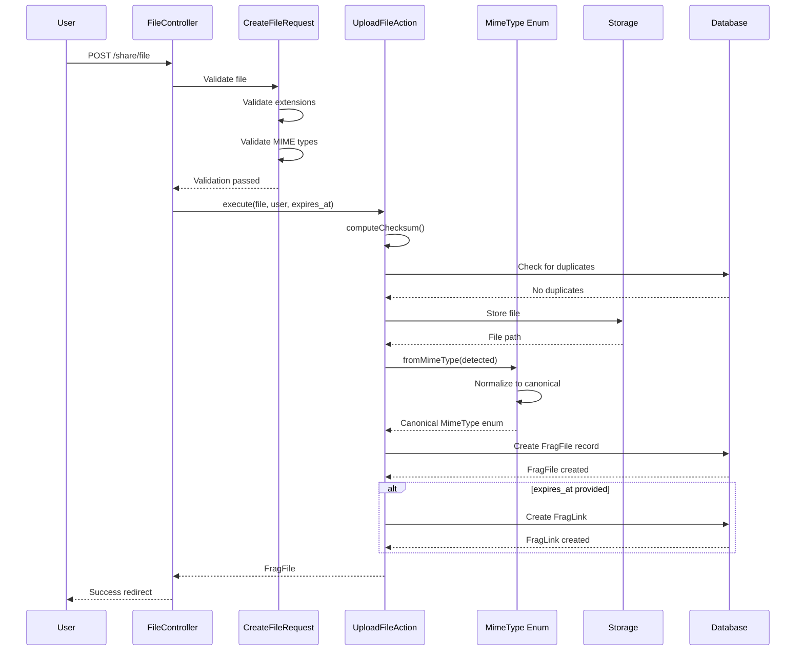

# File Upload System

## Overview

The file upload system handles secure file uploads with validation, MIME type normalization, and deduplication. It supports multiple file formats and ensures that files are properly validated before storage.

## Supported File Types

| Extension | Primary MIME Type | Alternative MIME Types | Description |
|-----------|------------------|----------------------|-------------|
| `.png` | `image/png` | - | PNG images |
| `.jpg`, `.jpeg` | `image/jpeg` | - | JPEG images |
| `.gif` | `image/gif` | - | GIF images |
| `.mp4` | `video/mp4` | - | MP4 videos |
| `.webp` | `image/webp` | - | WebP images |
| `.obj` | `application/prs.wavefront-obj` | `text/plain`<br>`application/object`<br>`application/octet-stream`<br>`model/obj` | Wavefront 3D model files |

## Architecture

### Sequence Diagram



## Components

### 1. Request Validation (`CreateFileRequest`)

**Location:** `app/CreateFileRequest.php`

**Validation Rules:**
```php
'file' => "required|file|max:20480|extensions:{$extensions}|mimetypes:{$mimeTypes}"
```

- **`extensions:`** Validates the file extension (png, jpg, obj, etc.)
- **`mimetypes:`** Validates the actual MIME type of the file content
- **Max size:** 20MB (20480 KB)

The validation rules are dynamically generated from the `MimeType` enum to maintain a single source of truth.

### 2. MIME Type Enum (`MimeType`)

**Location:** `app/MimeType.php`

The `MimeType` enum serves as the single source of truth for all supported file types.

#### Key Methods

**`mimeTypes(): array`**
Returns all acceptable MIME types for a given file type. This is crucial for files like `.obj` that can be detected with different MIME types depending on the system.

**`fromMimeType(string $mimeType): ?self`**
Normalizes any valid MIME type variant to its canonical enum case.

Example:
```php
// All of these return MimeType::Obj
MimeType::fromMimeType('application/prs.wavefront-obj'); // Official
MimeType::fromMimeType('application/octet-stream');      // Generic detection
MimeType::fromMimeType('text/plain');                    // Text-based detection
```

**`fromExtension(string $extension): ?self`**
Gets the MimeType enum from a file extension.

### 3. Upload Action (`UploadFileAction`)

**Location:** `app/Actions/UploadFileAction.php`

#### Flow

1. **Compute Checksum**
   - Generates SHA-256 hash of the file
   - Used for deduplication

2. **Check Uniqueness**
   - Prevents duplicate uploads by the same user
   - Throws `DuplicateFileException` if duplicate found

3. **Store File**
   - Stores file in `storage/app/user_{id}/` directory
   - Preserves original filename

4. **Normalize MIME Type**
   - Detects the file's MIME type
   - Normalizes to canonical backing value using `MimeType::fromMimeType()`
   - **Critical:** Ensures database compatibility with enum casting

5. **Create Database Record**
   - Stores file metadata with normalized MIME type
   - Links file to user

6. **Create Shareable Link** (optional)
   - If `expires_at` is provided
   - Generates unique slug for sharing

## MIME Type Normalization

### Why Normalization is Needed

The same file type can be detected with different MIME types depending on:
- Operating system
- File upload library
- Browser implementation
- File content structure

For example, `.obj` files can be detected as:
- `application/prs.wavefront-obj` (official IANA standard)
- `application/octet-stream` (generic binary file)
- `text/plain` (because .obj files are text-based)
- `application/object` (alternative)
- `model/obj` (alternative)

### How Normalization Works

```php
// File detected as application/octet-stream
$detectedMimeType = $file->getClientMimeType(); // "application/octet-stream"

// Normalize to canonical enum case
$mimeType = MimeType::fromMimeType($detectedMimeType); // MimeType::Obj

// Store canonical backing value
$fragFile->mime_type = $mimeType->value; // "application/prs.wavefront-obj"
```

**Benefits:**
- Database consistency: All .obj files stored with the same MIME type
- Enum compatibility: The stored value matches the enum's backing value
- Flexibility: Accepts multiple detection methods

## Error Handling

### DuplicateFileException

**Thrown when:** User attempts to upload a file they've already uploaded (based on checksum)

**Response:**
- Redirects back with validation error
- Error message: "File with this signature already has been uploaded"

### Unsupported MIME Type

**Thrown when:** Detected MIME type is not in any `mimeTypes()` array

**Response:**
- Transaction rollback
- File removed from storage
- Redirects back with error message

### Storage Failure

**Thrown when:** File cannot be stored to disk

**Response:**
- Transaction rollback
- Redirects back with error message

## Database Schema

### `frag_files` Table

| Column | Type | Description |
|--------|------|-------------|
| `id` | bigint | Primary key |
| `user_id` | bigint | Foreign key to users |
| `filename` | string | Original filename |
| `path` | string | Storage path |
| `mime_type` | string | Normalized MIME type (enum backing value) |
| `size` | bigint | File size in bytes |
| `checksum` | string | SHA-256 hash for deduplication |
| `created_at` | timestamp | Upload timestamp |
| `updated_at` | timestamp | Last update timestamp |

**Note:** The `mime_type` column is cast to `MimeType::class` in the `FragFile` model, which is why normalization is critical.

## Testing

### Test Coverage

**Location:** `tests/Feature/FileUploadTest.php`

- ✅ Upload standard files (PNG, JPG, etc.)
- ✅ Reject duplicate uploads
- ✅ Reject unsupported file types
- ✅ Allow same file upload by different users
- ✅ Create shareable links with expiration
- ✅ Upload .obj files (standard detection)
- ✅ Upload .obj files (octet-stream detection)

### Adding New File Types

To add support for a new file type:

1. **Add enum case to `MimeType`:**
   ```php
   case NewType = 'primary/mime-type';
   ```

2. **Update `extension()` method:**
   ```php
   self::NewType => 'ext',
   ```

3. **Update `mimeTypes()` method:**
   ```php
   self::NewType => ['primary/mime-type', 'alternative/mime-type'],
   ```

4. **Update `fromExtension()` method:**
   ```php
   'ext' => self::NewType,
   ```

5. **Write tests** to verify upload works

No changes needed in:
- ❌ Validation rules (auto-generated from enum)
- ❌ Upload action (uses generic normalization)
- ❌ Database schema (stores as string)

## Security Considerations

1. **File Extension Validation:** Prevents execution of malicious scripts
2. **MIME Type Validation:** Ensures file content matches claimed type
3. **Size Limits:** 20MB maximum to prevent DoS
4. **Checksum Deduplication:** Prevents storage exhaustion attacks
5. **User Isolation:** Files stored in user-specific directories

## Future Improvements

- [ ] Virus scanning integration
- [ ] Image optimization for uploaded images
- [ ] Thumbnail generation
- [ ] CDN integration for file serving
- [ ] Batch upload support
- [ ] Progress tracking for large uploads